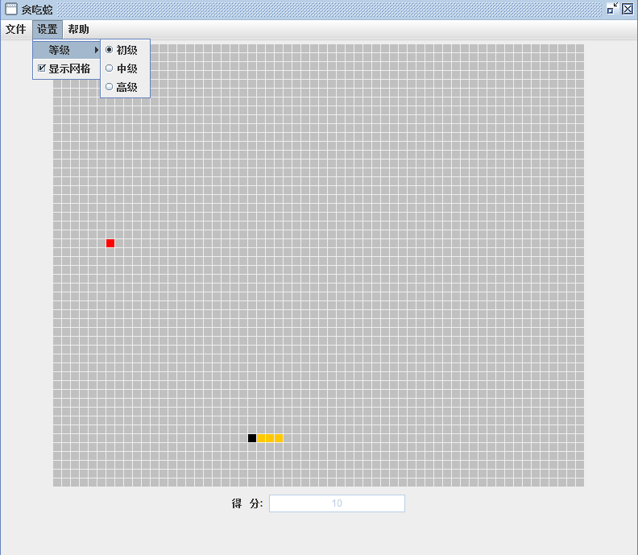

<h1 align="center">26.基于java的swing贪吃蛇</h1>

 获取sql文件 QQ: 386869957 QQ群: 377586148 

 [推荐站点: 从戎源码网](https://armycodes.com/) 

## 简介

> 本代码来源于网络,仅供学习参考使用!
>
> 提供1.远程部署/2.修改代码/3.设计文档指导/4.框架代码讲解等服务

## 项目介绍

基于java的swing贪吃蛇：java语言开发的贪吃蛇游戏小项目，界面使用awt、swing的jdk内置包开发出来，没有依赖任何第三方包，贪吃蛇功能齐全代码简洁。

## 环境

- <b>IntelliJ IDEA 2009.3</b>

- <b>JDK 1.8</b>

## 运行截图

